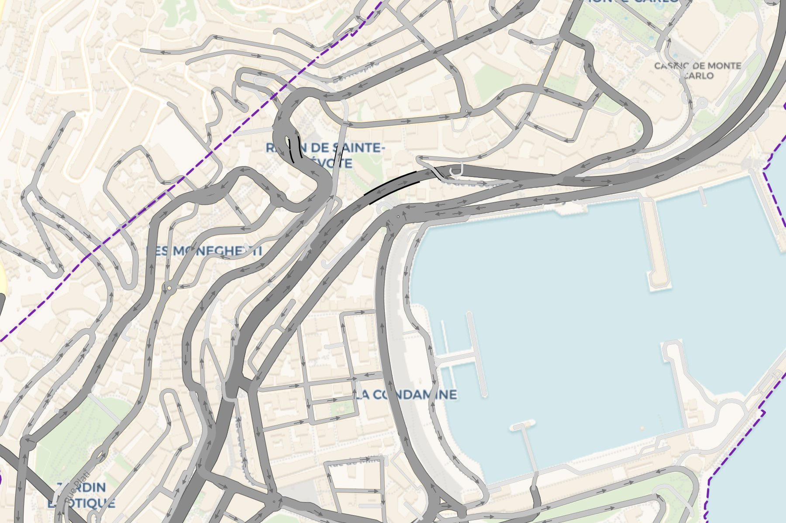

# Gallery

<p class="lead">One look per entry: the code that makes it, and a real picture of Monaco.</p>

Every entry starts from the bundled sample:

```python
import geopandas as gpd, pandas as pd, lanestyle as ls
lanes = gpd.read_parquet("docs/data/monaco_lanes.parquet")
turns = pd.read_parquet("docs/data/monaco_turns.parquet")
```

## The defaults

```python
ls.render_lanes(lanes, turns=turns)        # mono palette on Voyager, lanes 3.25 m wide from zoom 16
```

<div class="ls-shot" markdown>

</div>

## Lane lines

Zoom 20 on Boulevard Princesse Charlotte: a bus lane and two lanes, dashed dividers and grey edges,
each 0.15 m or 0.10 m wide in the world, stopping where the road enters the mini-roundabout.

<div class="ls-shot" markdown>

</div>

## A roundabout

The roundabout on Avenue Charles III: a ring mapped as many OSM ways is one road, its lanes one continuous curve, the
lanes that join and leave it cut where they meet its surface.

<div class="ls-shot" markdown>

</div>

## A tunnel

Tunnel Dorsale passing under Avenue Prince Pierre: a tunnel lane is an ordinary lane one level down, drawn under the
ground lanes by its OSM `layer` tag, with its arrows and lane lines like any other.

<div class="ls-shot" markdown>

</div>

## Bus lanes

Bus, bike and walk lanes are painted over the palette, and their colours are rows in the Roads box. A footpath is
drawn 2 m wide and an on-road bike lane 1.5 m. To see a road with its sidewalks, read the driving and walking modes
together: `ls.from_gmns(db, modes=("driving", "walking"))`.

```python
ls.render_lanes(lanes, turns=turns, settings={"lanes": {"colors": {"bus": "#d35400"}}})
```

<div class="ls-shot" markdown>

</div>

## Click a lane

The clicked lane red, the lanes it leads into green, U-turns purple, the popup with the lane's
road, type, turns in and out, width and ids.

<div class="ls-shot" markdown>

</div>

## Other looks

```python
ls.render_lanes(lanes, turns=turns, basemap="dark_matter")                 # dark
ls.render_lanes(lanes, turns=turns, palette="carto", basemap="positron")   # OSM-Carto colours
ls.render_lanes(lanes, turns=turns, basemap="satellite")                   # over imagery
ls.render_lanes(lanes, settings={"lanes": {"lines": False, "type_label_zoom": None}})   # plain lanes
```

Every roadstyle keyword works, since `render_lanes` passes them on: roadstyle's
[gallery](https://khoshkhah.github.io/roadstyle/gallery/) shows them.
