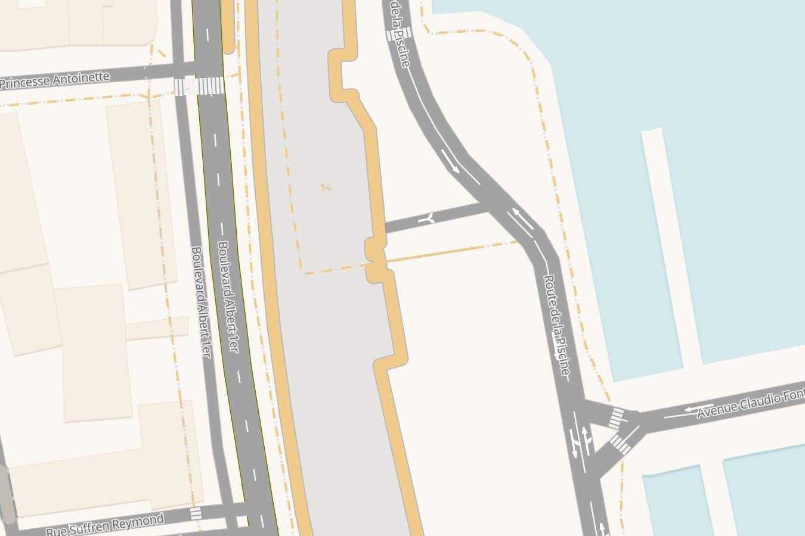
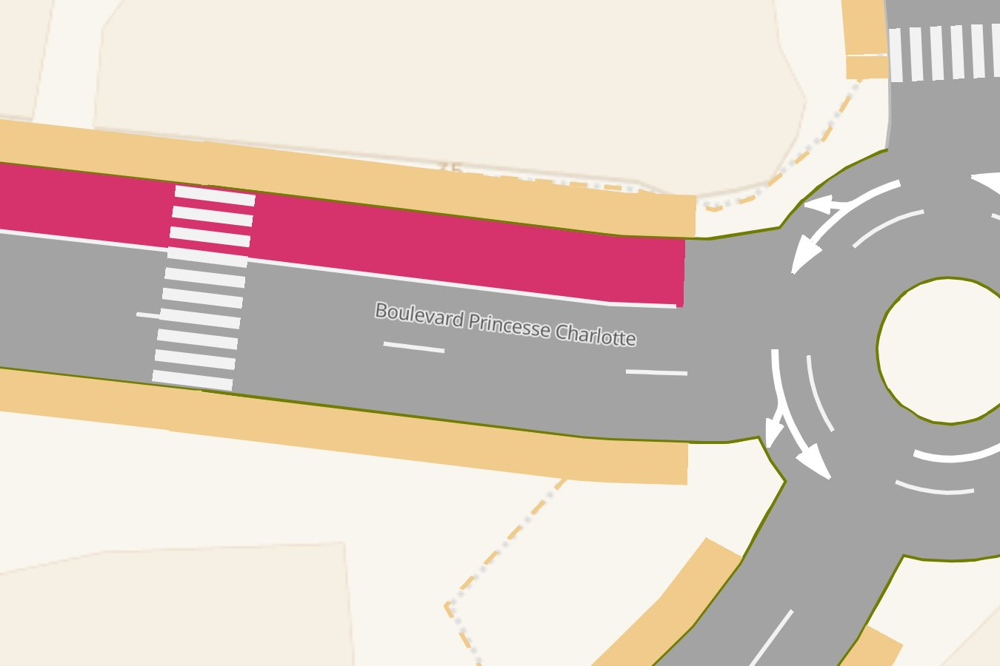
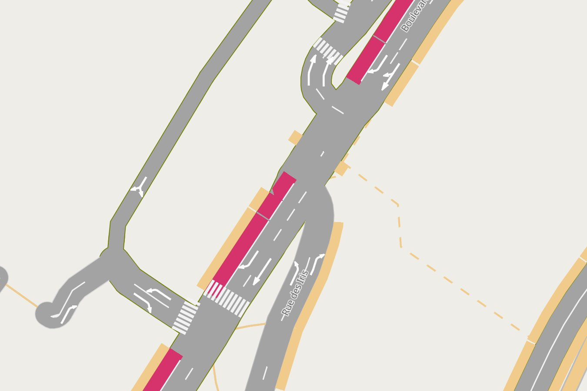
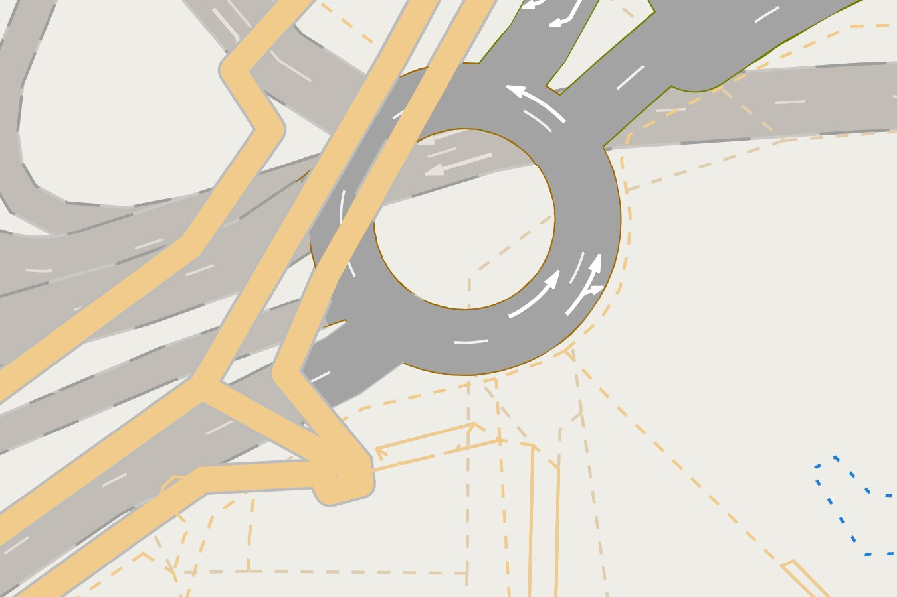
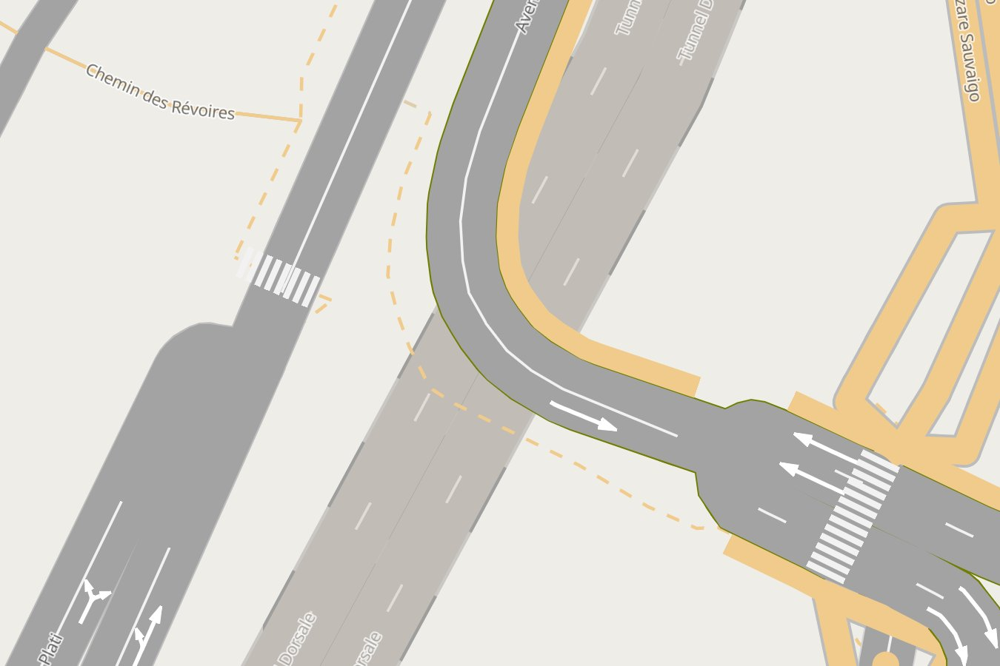
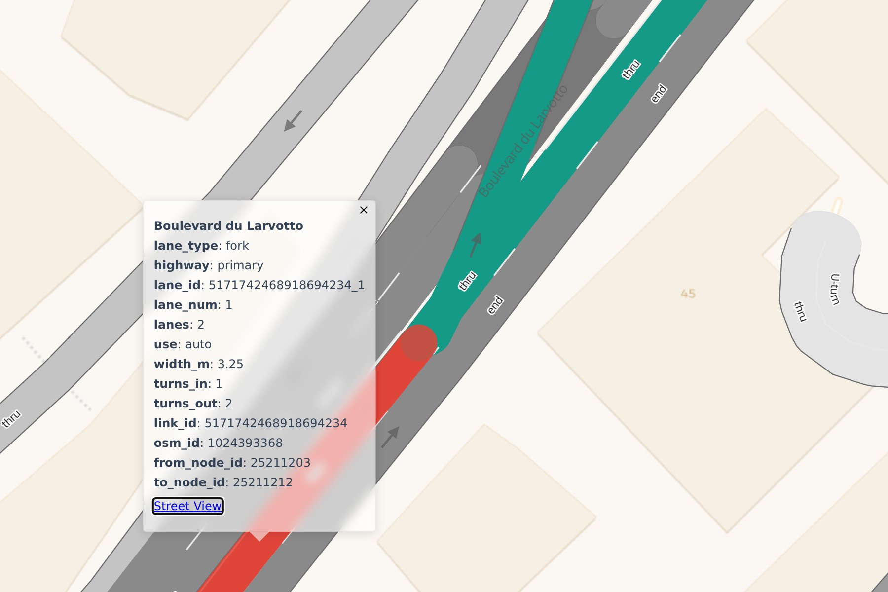

# Gallery

Monaco, from the lane page. Every place is on the <a href="maps/monaco.html">live map</a> too.

## Boulevard Albert 1er

Arrows before each junction, lane lines from zoom 17, zebras at three junctions, the sidewalks of the
plaza. Zoom 18.

## A bus lane at a roundabout

Boulevard Princesse Charlotte: its bus lane, a zebra across both lanes, sidewalks on both sides, and the
roundabout's arrows. Zoom 20.

## Bus lanes

Bus lanes with their solid lines, zebras, and the turn arrows of the streets around them.

## The Charles III roundabout

The roundabout over the tunnels under it: a tunnel's lanes and paint take the tunnel's colour.

## A tunnel

Tunnel Dorsale passes under Avenue Prince Pierre: roadstyle draws it under, in the tunnel colour.

## Click a lane

A click on a lane highlights it and opens its popup: its road, number, use and width.
