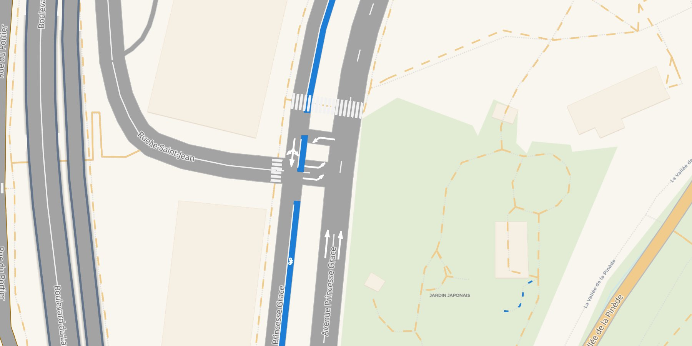

# lanestyle

<p class="lead">Lane-level road maps for Python: every road as wide as its lanes, with its bus and bike lanes, lane lines, turn arrows, zebra crossings and sidewalks. One offline HTML page.</p>

<div class="ls-hero" markdown>

</div>

```bash
pip install lanestyle "duckosm[levels]"
```

```python
import lanestyle as ls

ls.lane_page("monaco.levels", "monaco_gmns.duckdb", "monaco.duckdb").save("lanes.html")
```

lanestyle draws nothing of its own. [roadstyle](https://khoshkhah.github.io/roadstyle/) draws every
road: one line as wide as its lanes, with its outline, bridges over and tunnels under, street names,
hover and click, exactly as roadstyle's level editor draws it. lanestyle reads the lanes that
[duckOSM](https://github.com/Khoshkhah/duckOSM) exports (GMNS, with the turns from SUMO) and puts them
on those roads, so a road you fix in the editor is fixed on the page too.

## What you can do

<div class="grid cards" markdown>

-   :material-rocket-launch-outline:{ .lg .middle } **Map an area**

    ---

    Three duckOSM commands and one call, from an OpenStreetMap extract to the page.

    [:octicons-arrow-right-24: Get started](get-started.md)

-   :material-bus:{ .lg .middle } **Lanes and markings**

    ---

    Bus and bike lanes, dashed and solid lane lines, turn arrows, BUS and bike marks, in metres.

    [:octicons-arrow-right-24: Lanes and markings](guides/lanes-and-markings.md)

-   :material-walk:{ .lg .middle } **Junctions, zebras, sidewalks**

    ---

    Lanes stop where a junction begins; painted crossings and tagged sidewalks, nothing guessed.

    [:octicons-arrow-right-24: Junctions, zebras and sidewalks](guides/junctions-zebras-sidewalks.md)

-   :material-layers-edit:{ .lg .middle } **Fix the drawing**

    ---

    Which road is over which, and how its ends look: roadstyle's level editor, with your lanes on it.

    [:octicons-arrow-right-24: The editor](guides/editor.md)

-   :material-tune-variant:{ .lg .middle } **Settings**

    ---

    Colours, widths, dashes, marks: one `lanestyle.json`.

    [:octicons-arrow-right-24: Settings](guides/settings.md)

-   :material-fullscreen:{ .lg .middle } **See it live**

    ---

    Monaco, lane by lane, full screen in your browser.

    [:octicons-arrow-right-24: Live map](maps/monaco.html)

</div>

## The family

| | draws | from |
|---|---|---|
| [roadstyle](https://khoshkhah.github.io/roadstyle/) | a road network, one line per edge | any edges GeoDataFrame |
| [mapstyle](https://khoshkhah.github.io/mapstyle/) | a whole base map with the roads | a duckOSM database |
| **lanestyle** | the lanes and markings on every road | a duckOSM database, its GMNS lanes and level area |

All three save one HTML page that works offline and speaks the same `rs*` JavaScript API.
